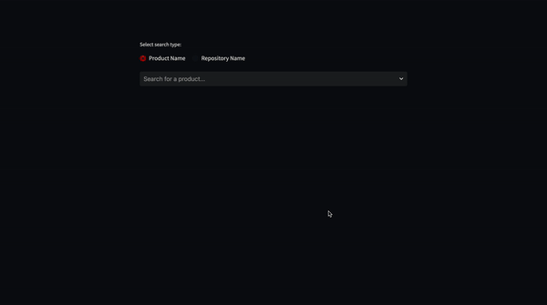

# PointOfContactAPI

- [PointOfContactAPI](#PointOfContactAPI)
    - [Setup](#Setup)
        - [API](#API)
        - [Example](#example-usage)
    - [Documentation](#Documentation)
        - [Contact from Repository](#get-point-of-contact-from-repository-name)
        - [Contact from Product](#get-point-of-contact-from-product-name)
        - [Entire Team Contact](#get-entire-team-contact-information-from-product-name)


## Setup

## API
Clone the code
```python
git clone https://github.com/gannont14/PointOfContactAPI.git
```

Create a virtual environment 
```python
python3 -m venv .venv
```

Activate the virtual environment 
```python 
source ./venv/bin/activate
```

Install the requirements 
```python
pip install -r requirements.txt
```

Run the flask app
```python
flask run
```

## Example Usage
- Example proof of concept web app, using the API to allow the user to search for results based on product name or repository name, as well as autocompletion with fuzzy finding with Levenshtein distance algorithm


### How to use yourself

While having the flask application running, create a new terminal instance,

Activate the virtual environment in the repository again,
```python 
source ./venv/bin/activate
```

Run the example web app
```python 
streamlit run streamlit/main.py
```


## Documentation

## Get Point of Contact from repository name
```rs
GET /api/repos
Parameters:
    search_query=repo_name
```

```json
[
  {
    "repo name": "string",
    "repo url": "string",
    "product name": "string",
    "first name": "string",
    "last name": "string",
    "email": "string",
    "chat username": "string",
    "location": "string",
    "role": "string"
  }
]
```

-  Example using a search query of "Enterprise-wide-empowering-circuit-repo" 

```rs
GET /api/repos
Parameters:
    search_query=enterprise-wide-empowering-circuit-repo
```

```json
[
  {
    "repo name": "Enterprise-wide-empowering-circuit-repo",
    "repo url": "https://github.com/sc1701d/enterprise-wide-empowering-circuit-repo",
    "product name": "Enterprise-wide empowering circuit",
    "first name": "Erika",
    "last name": "McKnight",
    "email": "erica.mcknight@sc1701d.com",
    "chat username": "@erikamcknight",
    "location": "Chicago, IL",
    "role": "Scrum Master"
  }
]
```


## Get point of contact from product name
```rs
GET /api/products
Parameters:
    search_query=repo_name
```

```json
[
  {
    "product name": "string",
    "first name": "string",
    "last name": "string",
    "email": "string",
    "chat username": "string",
    "location": "string",
    "role": "string"
  }
]
```

-  Example using a search query of "Managed systematic Intranet" 

```rs
GET /api/products
Parameters:
    search_query=managed systematic intranet
```

```json
[
    {
        "product name": "Managed systematic intranet",
        "first name": "Chad",
        "last name": "Hunt",
        "email": "chad.hunt@sc1701d.com",
        "chat username": "@chadhunt",
        "location": "Bloomington, IN",
        "role": "Scrum Master"
    }
]
```

## Get entire team contact information from product name

```rs
GET /api/products/all_contacts
Parameters:
    product_name=product_name
```

-   Returns a list of all contacts associated with a project, and their roles

```json
[
  {
    "product name": "string",
    "first name": "string",
    "last name": "string",
    "email": "string",
    "chat username": "string",
    "location": "string",
    "role": "string"
  },
  "..."
]
```

-  Example using a search query of "fundamental optimizing paradigm" 

```rs
GET /api/products/all_contacts
Parameters:
    product_name=fundamental optimizing paradigm
```

```json
[
    {
        "product name": "Fundamental optimizing paradigm",
        "first name": "Gregory",
        "last name": "Barton",
        "email": "gregory.barton@sc1701d.com",
        "chat username": "@gregorybarton",
        "location": "Berlin, DE",
        "role": "Scrum Master"
    },
    {
        "chat username": "@michaelbaker",
        "email": "michael.baker@sc1701d.com",
        "first name": "Michael",
        "last name": "Baker",
        "location": "Berlin, DE",
        "product name": "Fundamental optimizing paradigm",
        "role": "Product Owner"
    },
    "..."
```
